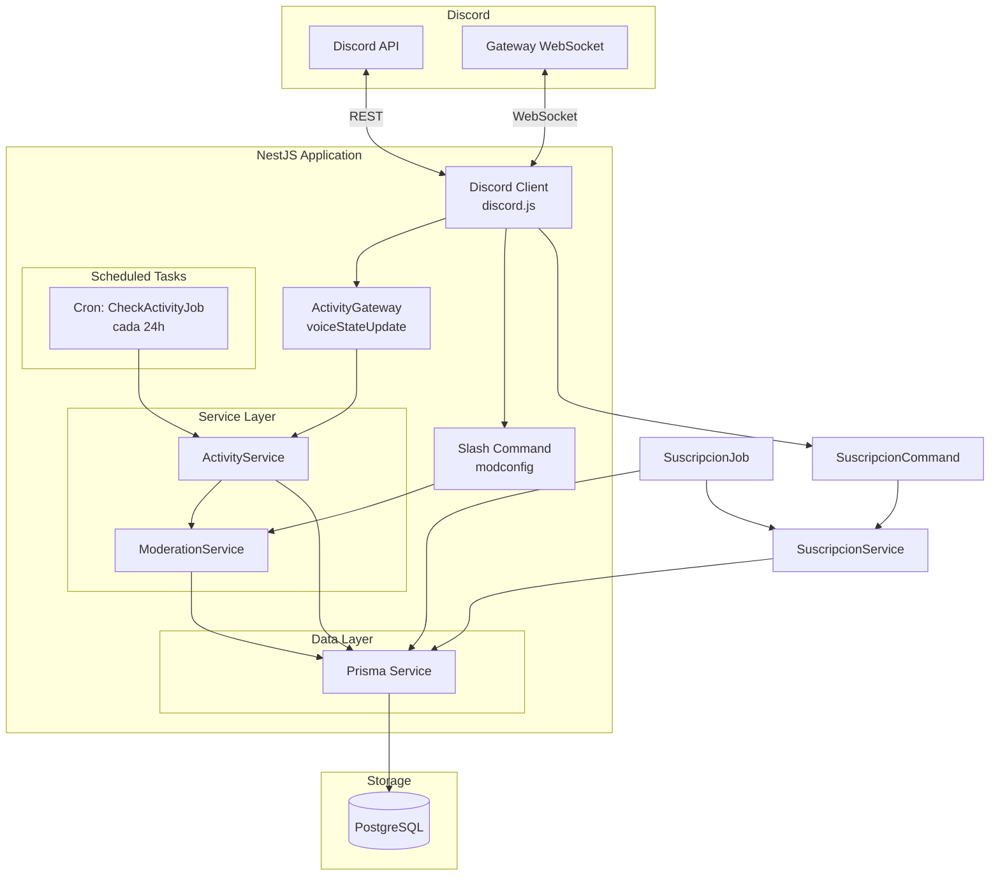
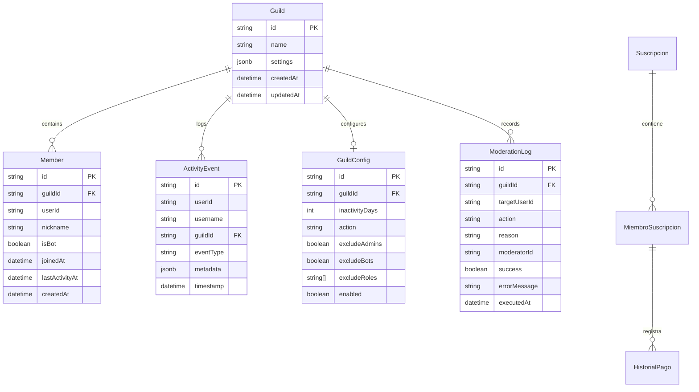

# Arquitectura del Bot de Discord

> [!info] Propósito
> Bot de moderación que monitorea actividad de voz y expulsa/banea automáticamente a aquellos sin actividad en los últimos 3 días. Además, gestiona suscripciones compartidas entre miembros de la comunidad (pagos, historial, recordatorios).

## Stack Tecnológico y Patrones

### Tecnologías

| Capa | Tecnología | Justificación |
|------|-----------|---------------|
| Runtime | Node.js (LTS) + TypeScript | Tipado estático, ecosistema maduro |
| Framework | [[NestJS]]  | Arquitectura modular decorators-first, DI nativa |
| ORM | [[Prisma]] | Type-safe queries, migraciones automáticas |
| Base de Datos | [[PostgreSQL]]  | Robusta, soporte JSONB, confiable |
| Contenedores | [[Docker]] + Docker Compose | Reproducibilidad, dev/prod parity |
| Cliente Discord | `discord.js` (v14+) | SDK oficial, soporte completo de Gateway Intents |

### Patrón Arquitectónico

**Monolito Modular** con enfoque hexagonal implícito:

```
┌─────────────────────────────────────────────────────┐
│                    API Layer                         │
│  (Slash Commands, Event Handlers, Middleware)        │
├─────────────────────────────────────────────────────┤
│                  Service Layer                       │
│  (ActivityService, ModerationService, MemberService) │
├─────────────────────────────────────────────────────┤
│                  Repository Layer                    │
│  (PrismaService, GatewayRepository)                  │
├─────────────────────────────────────────────────────┤
│                  Infrastructure                      │
│  (Discord Client, Cron Jobs, Logger, Rate Limiter)  │
└─────────────────────────────────────────────────────┘
```

Cada módulo de NestJS encapsula su dominio: `ActivityModule`, `ModerationModule`, `SuscripcionModule`. La inyección de dependencias mantiene bajo acoplamiento.

> [!tip] NestJS soporta nativamente `@Cron` de `@nestjs/schedule` para la tarea periódica de revisión de actividad.

## Diagrama de Componentes



### Flujo de Actividad (Moderación)

1. **Usuario se conecta a un canal de voz** → Discord Gateway emite `voiceStateUpdate`
2. **ActivityGateway** guarda `{ joinTime }` en un Map en memoria (sesión iniciada)
3. **Usuario se desconecta** → se calcula `(now - joinTime)` en minutos
4. **Si ≥ 30 minutos** → `ActivityService.recordActivity()` actualiza `lastActivityAt` en PostgreSQL
5. **Si < 30 minutos** → se ignora, no reinicia el contador
6. **Cada 24h**, `CheckActivityJob` ejecuta query: miembros con `lastActivityAt < NOW() - INTERVAL '3 days'`
7. **ModerationService** ejecuta `kick()` o `ban()` contra Discord API
8. **Resultado** se persiste en tabla `ModerationLog`

### Flujo de Suscripciones Compartidas

1. **Admin crea suscripción** → `/suscripcion crear` registra el servicio en PostgreSQL
2. **Usuarios se unen** → `/suscripcion unirse` los agrega como miembros (respetando cupo)
3. **Admin registra pagos** → `/pagar` crea `HistorialPago` y suma `mesesAFavor` al miembro
4. **Cada mes (cron)** → el día posterior al `diaCobro`, se descuenta 1 mes a quienes tienen saldo
5. **3 días antes del cobro (cron)** → se envía recordatorio al canal tagging a pendientes
6. **Usuarios consultan estado** → `/suscripcion estado` y `/suscripcion historial`

## Modelo de Datos Principal



### Schema Prisma

```prisma
model Guild {
  id        String   @id
  name      String
  settings  Json?    @default("{}")
  createdAt DateTime @default(now())
  updatedAt DateTime @updatedAt

  members Member[]
  events  ActivityEvent[]
  config  GuildConfig?
  logs    ModerationLog[]
}

model Member {
  id             String   @id @default(cuid())
  guildId        String
  userId         String
  nickname       String?
  isBot          Boolean  @default(false)
  joinedAt       DateTime
  lastActivityAt DateTime
  createdAt      DateTime @default(now())

  guild Guild @relation(fields: [guildId], references: [id])

  @@unique([guildId, userId])
  @@index([guildId, lastActivityAt])
}

model ActivityEvent {
  id        String   @id @default(cuid())
  userId    String
  username  String?
  guildId   String
  eventType String
  metadata  Json?    @default("{}")
  timestamp DateTime @default(now())

  guild Guild @relation(fields: [guildId], references: [id])

  @@index([userId, timestamp])
}

model GuildConfig {
  id             String   @id @default(cuid())
  guildId        String   @unique
  inactivityDays Int      @default(3)
  action         String   @default("kick")
  excludeAdmins  Boolean  @default(true)
  excludeBots    Boolean  @default(true)
  excludeRoles   String[] @default([])
  enabled        Boolean  @default(false)

  guild Guild @relation(fields: [guildId], references: [id])
}

model ModerationLog {
  id           String   @id @default(cuid())
  guildId      String
  targetUserId String
  action       String
  reason       String
  moderatorId  String
  success      Boolean
  errorMessage String?
  executedAt   DateTime @default(now())

  guild Guild @relation(fields: [guildId], references: [id])
}

model Suscripcion {
  id                Int      @id @default(autoincrement())
  nombre            String   @unique
  montoTotal        Decimal
  diaCobro          Int
  limiteUsuarios    Int
  adminDiscordId    String
  canalRecordatorio String?
  createdAt         DateTime @default(now())
  updatedAt         DateTime @updatedAt
  miembros          MiembroSuscripcion[]
}

model MiembroSuscripcion {
  id               Int      @id @default(autoincrement())
  suscripcionId    Int
  usuarioDiscordId String
  mesesAFavor      Int      @default(0)
  createdAt        DateTime @default(now())
  suscripcion      Suscripcion   @relation(fields: [suscripcionId], references: [id], onDelete: Cascade)
  historial        HistorialPago[]
  @@unique([suscripcionId, usuarioDiscordId])
}

model HistorialPago {
  id                   Int      @id @default(autoincrement())
  miembroSuscripcionId Int
  montoPagado          Decimal
  mesesCubiertos       Int
  fechaPago            DateTime @default(now())
  miembro              MiembroSuscripcion @relation(fields: [miembroSuscripcionId], references: [id], onDelete: Cascade)
}
```

## Infraestructura y Despliegue

### Estructura Docker

```
bot-discord/
├── Dockerfile
├── docker-compose.yml
├── .env.example
├── prisma/
│   ├── schema.prisma
│   └── migrations/
├── src/
│   ├── main.ts
│   ├── app.module.ts
│   ├── activity/
│   ├── moderation/
│   ├── guild/
│   ├── scheduling/
│   └── common/
└── test/
```

### docker-compose.yml

```yaml
version: "3.8"
services:
  bot:
    build: .
    env_file: .env
    depends_on:
      postgres:
        condition: service_healthy
    restart: unless-stopped
    logging:
      driver: "json-file"
      options:
        max-size: "10m"
        max-file: "3"

  postgres:
    image: postgres:16-alpine
    environment:
      POSTGRES_DB: discord_bot
      POSTGRES_USER: ${DB_USER}
      POSTGRES_PASSWORD: ${DB_PASSWORD}
    volumes:
      - pgdata:/var/lib/postgresql/data
    healthcheck:
      test: ["CMD-SHELL", "pg_isready -U ${DB_USER} -d discord_bot"]
      interval: 5s
      timeout: 5s
      retries: 5

volumes:
  pgdata:
```

### Variables de Entorno

```env
# .env.example
DISCORD_TOKEN=your_bot_token
DISCORD_CLIENT_ID=your_client_id
DISCORD_GUILD_ID=your_guild_id

DB_HOST=postgres
DB_PORT=5432
DB_USER=discord_bot
DB_PASSWORD=secure_password
DB_NAME=discord_bot

NODE_ENV=production
LOG_LEVEL=info
```

> [!warning] Nunca commitees el `.env` real. Usa `.env.example` como template y agrega `.env` a `.gitignore`.

## Requisitos No Funcionales y Resiliencia

### Rate Limits de Discord API

| Estrategia | Implementación |
|-----------|---------------|
| **Global** | `@discordjs/rest` maneja headers `X-RateLimit-*` automáticamente |
| **Bucket** | Agrupar requests por bucket (guild + endpoint) |
| **Backoff** | Retry con backoff exponencial + jitter en 429s |
| **Cola** | Queue de moderation actions con prioridad |

```typescript
// Estrategia de backoff
async function executeWithRetry<T>(
  fn: () => Promise<T>,
  maxRetries = 3,
): Promise<T> {
  for (let attempt = 0; attempt < maxRetries; attempt++) {
    try {
      return await fn();
    } catch (error) {
      if (error instanceof DiscordAPIError && error.status === 429) {
        const retryAfter = error.retryAfter * 1000 + Math.random() * 1000;
        await sleep(retryAfter);
        continue;
      }
      throw error;
    }
  }
}
```

### Reconexión WebSocket

El SDK `discord.js` maneja reconexión automática con backoff. Configuración recomendada:

```typescript
const client = new Client({
  intents: [
    GatewayIntentBits.Guilds,
    GatewayIntentBits.GuildVoiceStates,
    GatewayIntentBits.GuildMembers,
  ],
  failIfNotExists: false,
  // Reconexión nativa: activa por defecto
});
```

> [!tip] Escucha el evento `shardDisconnect` para loggear y triggerear alertas en producción.

### Logs Estructurados

Usar `pino` o `winston` con formato JSON para integración con sistemas de logging externos:

```typescript
// Ejemplo con pino
const logger = pino({
  level: process.env.LOG_LEVEL || 'info',
  transport:
    process.env.NODE_ENV === 'development'
      ? { target: 'pino-pretty' }
      : undefined,
});

logger.info({ guildId, userId, action }, 'Moderation action executed');
```

### Tolerancia a Fallos

| Escenario | Estrategia |
|-----------|-----------|
| DB caída | Retry connection con backoff; el bot sigue operando pero sin persistencia |
| Discord API down | Queue de moderación en memoria; re-intentar en próxima ventana |
| Bot se cae | `restart: unless-stopped` en Docker; graceful shutdown con `SIGTERM` |
| Error en medio de batch | Procesar miembros uno por uno; loggear fallos individuales sin abortar batch |

### Health Check Endpoint

```typescript
@Controller('health')
export class HealthController {
  @Get()
  async check() {
    const dbOk = await prisma.$queryRaw`SELECT 1`;
    const wsOk = client.ws.status === WebSocketShardStatus.Ready;

    return {
      status: dbOk && wsOk ? 'ok' : 'degraded',
      discord: wsOk ? 'connected' : 'disconnected',
      database: dbOk ? 'connected' : 'disconnected',
      timestamp: new Date().toISOString(),
    };
  }
}
```

---

> [!abstract] Módulos Implementados
> 1. [[Registrar Bot en Discord Portal]]
> 2. [[Configurar NestJS + Prisma]]
> 3. [[Implementar ActivityModule]]
> 4. [[Implementar ModerationModule]]
> 5. [[Implementacion SuscripcionModule]] — ⭐ Nuevo
> 6. [[Guia de Uso - Suscripciones Compartidas]] — Guía para usuarios
> 7. [[Dockerizar y desplegar]]
