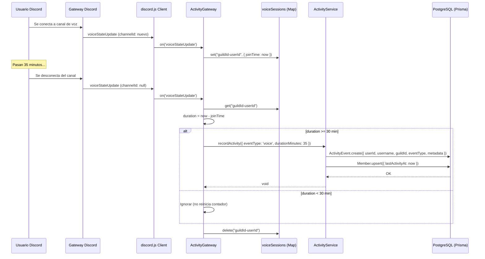

# Implementación del ActivityModule

> [!success] Estado
> ✅ **Completado** — Módulo de actividad implementado y compila sin errores.

## Resumen del Desarrollo Agentico

Se utilizaron **3 agentes** para implementar esta fase:

```mermaid
gantt
    title Fase 2 - Desarrollo Agentico
    dateFormat  HH:mm
    axisFormat %H:%M
    
    section Fase 2A - Paralelo
    Agente A: DiscordModule              :a1, 10:00, 3m
    Agente B: ActivityModule             :b1, 10:00, 4m
    
    section Fase 2B - Integración
    Agente C: AppModule + Build          :c1, after a1, 2m
```



| Agente | Archivos creados |
|--------|------------------|
| **A** — DiscordModule | `discord/constants.ts`, `discord/discord.service.ts`, `discord/discord.module.ts` |
| **B** — ActivityModule | `activity/dto/activity-event.dto.ts`, `activity/activity.service.ts`, `activity/activity.gateway.ts`, `activity/activity.module.ts` |
| **C** — Integración | Modificó `app.module.ts`, corrigió type error y verificó build |

## Arquitectura del DiscordModule

El `DiscordModule` es **Global** y provee dos cosas a toda la aplicación:

1. `DiscordService` — maneja el ciclo de vida del `Client` de discord.js
2. `DISCORD_CLIENT` — token de inyección para acceder al `Client` directamente

```typescript
// discord.module.ts
@Global()
@Module({
  providers: [
    DiscordService,
    {
      provide: DISCORD_CLIENT,
      useFactory: (service: DiscordService) => service.client,
      inject: [DiscordService],
    },
  ],
  exports: [DiscordService, DISCORD_CLIENT],
})
export class DiscordModule {}
```

### Intents Configurados

| Intent | ¿Por qué? |
|--------|-----------|
| `Guilds` | Información del servidor |
| `GuildVoiceStates` | Detectar conexión a voz |
| `GuildMembers` | Listar miembros del servidor |

### DTO de ActivityEvent

```typescript
export interface RecordActivityDto {
  guildId: string;
  userId: string;
  username?: string;
  eventType: string;
  metadata?: Record<string, unknown>;
  timestamp?: Date;
}
```

### Manejo de Lifecycle

```typescript
async onModuleInit() {
  const token = process.env.DISCORD_TOKEN;
  if (!token) {
    console.warn('DISCORD_TOKEN no configurado — el bot no se conectará a Discord');
    return;
  }
  await this.client.login(token);
}

async onModuleDestroy() {
  if (this.client.isReady()) {
    this.client.destroy();
  }
}
```

> [!tip] Si no hay `DISCORD_TOKEN`, el bot **advierte pero no falla**. Ideal para desarrollo sin conexión a Discord.

## Arquitectura del ActivityModule

### Flujo de Datos



### ActivityGateway — Eventos Escuchados

Ahora solo escucha `voiceStateUpdate`. Las sesiones se tracking en un `Map` en memoria y se requiere un mínimo de 30 minutos para registrar actividad.

```typescript
private readonly voiceSessions = new Map<string, { joinTime: Date }>();

private registerListeners(): void {
  this.client.on('voiceStateUpdate', (oldState, newState) => {
    this.handleVoiceStateUpdate(oldState, newState).catch((err) =>
      this.logger.error(`Error en voiceStateUpdate: ${err.message}`),
    );
  });
}

private async handleVoiceStateUpdate(oldState, newState): Promise<void> {
  const member = newState.member ?? oldState.member;
  if (!member || member.user.bot) return;

  const key = `${newState.guild.id}-${member.id}`;

  // Se unió a un canal
  if (!oldState.channelId && newState.channelId) {
    this.voiceSessions.set(key, { joinTime: new Date() });
    return;
  }

  // Salió del canal
  if (oldState.channelId && !newState.channelId) {
    const session = this.voiceSessions.get(key);
    if (!session) return;
    this.voiceSessions.delete(key);

    const durationMin = Math.floor((Date.now() - session.joinTime.getTime()) / 60000);

    if (durationMin >= 30) {
      await this.activityService.recordActivity({
        guildId: newState.guild.id,
        userId: member.id,
        username: member.user.username,
        eventType: 'voice',
        metadata: { durationMinutes: durationMin },
      });
    }
    // Si < 30 min, no se hace nada
  }
}
```

### ActivityService — Lógica de Negocio

El DTO ahora incluye `username?: string` y se hace un `Guild.upsert()` antes de la transacción para asegurar que el gremio exista en la base de datos.

```typescript
async recordActivity(dto: RecordActivityDto): Promise<void> {
  const { guildId, userId, eventType, metadata, timestamp } = dto;
  const now = timestamp ?? new Date();

  await this.prisma.guild.upsert({
    where: { id: guildId },
    update: {},
    create: { id: guildId, name: `Guild-${guildId}` },
  });

  await this.prisma.$transaction([
    this.prisma.activityEvent.create({
      data: {
        guildId, userId,
        username: dto.username,
        eventType,
        metadata: (metadata ?? {}) as Prisma.InputJsonValue,
        timestamp: now,
      },
    }),
    this.prisma.member.upsert({
      where: { guildId_userId: { guildId, userId } },
      update: { lastActivityAt: now },
      create: { guildId, userId, lastActivityAt: now, joinedAt: now },
    }),
  ]);
}

async getInactiveMembers(guildId: string, days: number): Promise<Member[]> {
  const cutoff = new Date(Date.now() - days * 24 * 60 * 60 * 1000);
  return this.prisma.member.findMany({
    where: { guildId, lastActivityAt: { lt: cutoff }, isBot: false },
  }) as Promise<Member[]>;
}
```

> [!warning] La transacción asegura que **siempre** se cree el evento Y se actualice el miembro. Si una de las dos operaciones falla, ninguna se ejecuta.

## Estructura de Archivos Creados

```
src/
├── app.module.ts               ← Modificado (importa DiscordModule + ActivityModule)
├── main.ts                     ← Sin cambios
│
├── discord/                    ← NUEVO: Módulo de Discord
│   ├── constants.ts            ← Token de inyección DISCORD_CLIENT
│   ├── discord.service.ts      ← Lifecycle del Client (login/destroy)
│   └── discord.module.ts       ← Módulo Global
│
├── activity/                   ← NUEVO: Módulo de Actividad
│   ├── dto/
│   │   └── activity-event.dto.ts  ← Interfaz RecordActivityDto
│   ├── activity.service.ts     ← Lógica de negocio
│   ├── activity.gateway.ts     ← Event handlers de Discord
│   └── activity.module.ts      ← Módulo
│
└── prisma/
    ├── prisma.service.ts       ← Sin cambios
    └── prisma.module.ts        ← Sin cambios
```

## Variables de Entorno Requeridas

Para que el bot funcione necesitas configurar en `.env`:

```env
DISCORD_TOKEN=MTk4NjIyNjg2ODQ5MjQzMjMy.Gu4R8x.xxxxx
DISCORD_CLIENT_ID=1506786045306339358
DISCORD_GUILD_ID=el_id_de_tu_servidor
```

> [!tip] Sigue la guía en [[Registrar Bot en Discord Portal]] para obtener cada valor.

### Mínimo de 30 Minutos en Voz

El bot **no reinicia el contador de inactividad** si el usuario estuvo menos de 30 minutos en un canal de voz. Esto evita que conexiones breves (entrar y salir rápido) mantengan activo a un usuario que realmente no participa.

Las sesiones de voz se guardan en un `Map<string, { joinTime: Date }>` en memoria:
- **Key**: `"guildId-userId"`
- **joinTime**: momento exacto en que se conectó
- Al desconectarse se calcula la diferencia y se elimina del Map

> [!tip] Las sesiones en memoria se pierden si el bot se reinicia. Solo afecta a usuarios que estaban conectados en ese momento — no tiene impacto en el comportamiento general.

## Referencias

- [[Arquitectura Bot Discord#Diagrama de Componentes]]
- [[Setup Inicial]] — fase anterior
- [[Implementar ModerationModule]] — próximo módulo a implementar
- [Documentación discord.js Events](https://discord.js.org/docs/packages/discord.js/14.15.3/Client:Class)
