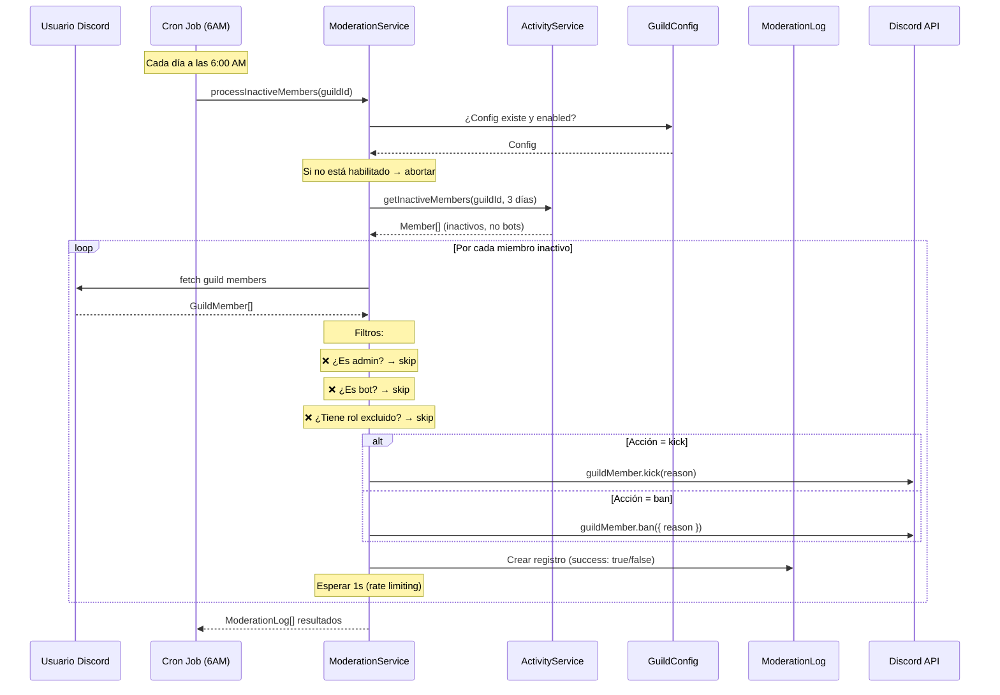
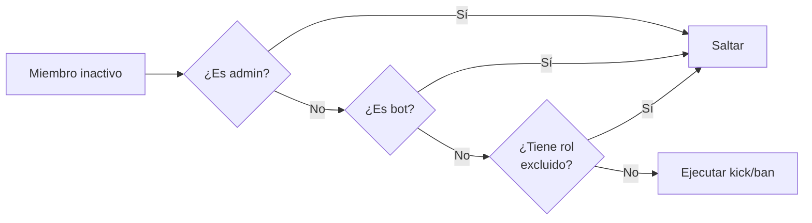

# Implementación del ModerationModule

> [!success] Estado
> ✅ **Completado** — Módulo de moderación implementado y compila sin errores.

## Resumen del Desarrollo Agentico

Se utilizaron **4 agentes** distribuidos en 3 fases:

```mermaid
gantt
    title Fase 3 - Desarrollo Agentico
    dateFormat  HH:mm
    axisFormat %H:%M
    
    section Fase 0 - Fix Schema
    Agente A: Fix relaciones Prisma       :a1, 09:00, 4m
    
    section Fase 1 - Paralelo con A
    Agente B: ModerationService + DTO     :b1, 09:00, 4m
    
    section Fase 2 - Secuencial
    Agente C: Command + Job + Module      :c1, after b1, 3m
    
    section Fase 3 - Integración
    Agente D: AppModule + Build           :d1, after c1, 1m
```



| Agente | Archivos creados |
|--------|------------------|
| **A** — Fix Schema | `prisma/schema.prisma` (modificado), migración `fix_relations`, `activity.service.ts` (modificado) |
| **B** — Service + DTO | `moderation/dto/update-config.dto.ts`, `moderation/moderation.service.ts` |
| **C** — Command + Job + Module | `moderation/moderation.command.ts`, `moderation/check-activity.job.ts`, `moderation/moderation.module.ts` |
| **D** — Integración | `app.module.ts` (modificado) |

## Fix de Schema (Agente A)

### Problemas Detectados

Antes de implementar la moderación se identificaron **2 bugs** en el schema original:

#### 1. Relación incorrecta en ActivityEvent

```diff
- memberId  String                  ← almacena Discord ID "123456789"
- member    Member @relation(...)   ← FK apunta a Member.id (cuid) → Error
+ userId    String                  ← ahora es un campo simple sin FK inválida
```

#### 2. Relación incorrecta en ModerationLog

```diff
- member Member @relation(fields: [targetUserId], references: [id])  ← mismo problema
+ // Relación eliminada — se consulta por targetUserId directamente
```

#### 3. Falta campo excludeRoles

```diff
+ excludeRoles String[] @default([])
```

### Migración Aplicada

```bash
npx prisma migrate dev --name fix_relations
```

## Arquitectura del ModerationModule

### Estructura de Archivos

```
src/moderation/
├── dto/
│   └── update-config.dto.ts         ← Interfaz UpdateConfigDto
├── moderation.service.ts            ← Lógica de moderación
├── moderation.command.ts            ← Slash command /modconfig
├── check-activity.job.ts            ← Cron job diario (6:00 AM)
└── moderation.module.ts             ← Módulo NestJS
```

### Flujo de Datos Completo



## ModerationService

### Métodos Expuestos

| Método | Parámetros | Retorno | Descripción |
|--------|-----------|---------|-------------|
| `getConfig` | `guildId: string` | `GuildConfig \| null` | Obtener configuración del servidor |
| `updateConfig` | `guildId: string`, `dto: UpdateConfigDto` | `GuildConfig` | Crear o actualizar configuración |
| `processInactiveMembers` | `guildId: string` | `ModerationLog[]` | Ejecutar moderación en miembros inactivos |

### Exclusiones Aplicadas



### Rate Limiting

```typescript
for (const member of inactiveMembers) {
  try {
    await discordMember.kick(reason);
    // ...
  } catch (err) {
    // log individual, NO aborta el batch
  }
  await sleep(1000); // ← 1 segundo entre cada acción
}
```

> [!warning] Sin el sleep de 1s, Discord API puede devolver `429 Too Many Requests`. El bot procesa un miembro por segundo como máximo.

## Slash Command: /modconfig

### Opciones

| Opción | Tipo | Requerido | Descripción |
|--------|------|-----------|-------------|
| `dias` | Integer (1-30) | No | Días de inactividad antes de moderar |
| `accion` | Choice: kick/ban | No | Acción a ejecutar |
| `habilitar` | Boolean | No | Activar/desactivar el sistema |
| `excluir-admins` | Boolean | No | Excluir admins del barrido |
| `excluir-bots` | Boolean | No | Excluir bots del barrido |

> [!warning] Solo administradores
> El comando `/modconfig` solo puede ser ejecutado por usuarios con permiso **Administrador** en el servidor. Cualquier otro usuario recibe un mensaje: "❌ Solo los administradores pueden usar este comando."

### Registro del Comando

El comando se registra automáticamente al iniciar el bot vía la REST API de Discord:

```typescript
const rest = new REST({ version: '10' }).setToken(process.env.DISCORD_TOKEN!);
await rest.put(Routes.applicationGuildCommands(process.env.DISCORD_CLIENT_ID!, guildId), {
  body: [command.toJSON()],
});
```

La variable `DISCORD_GUILD_ID` en `.env` determina en qué servidor se registra. Si no está configurada, el comando no se registra.

### Respuesta

```
Configuración actualizada
Estado: ✅ Activada
Días de inactividad: 3
Acción: Expulsar
Excluir admins: Sí
Excluir bots: Sí
```

> [!tip] La respuesta es **ephemeral** — solo la ve quien ejecuta el comando.

## Cron Job: CheckActivityJob

```typescript
@Cron('0 6 * * *')  // 6:00 AM todos los días
async checkAllGuilds(): Promise<void> {
  // Obtener todas las configs habilitadas
  // Para cada guild: processInactiveMembers()
  // Loggear resultados
}
```

El cron job:
- Corre **cada día a las 6:00 AM**
- Consulta todos los `GuildConfig` con `enabled: true`
- Ejecuta `processInactiveMembers` para cada uno
- Errores por guild no afectan a los demás

## Configuración por Servidor (GuildConfig)

| Campo | Tipo | Default | Descripción |
|-------|------|---------|-------------|
| `inactivityDays` | Int | 3 | Días sin actividad |
| `action` | String | `kick` | `kick` o `ban` |
| `excludeAdmins` | Bool | `true` | Excluir admins |
| `excludeBots` | Bool | `true` | Excluir bots |
| `excludeRoles` | String[] | `[]` | IDs de roles excluidos |
| `enabled` | Bool | `false` | Sistema activo/inactivo |

## Archivos Creados/Modificados

```
src/
├── app.module.ts                          ← MODIFICADO: importa ModerationModule
│
├── moderation/                            ← NUEVO
│   ├── dto/
│   │   └── update-config.dto.ts
│   ├── moderation.service.ts
│   ├── moderation.command.ts
│   ├── check-activity.job.ts
│   └── moderation.module.ts
│
├── activity/
│   └── activity.service.ts                ← MODIFICADO: memberId → userId
│
└── prisma/
    └── schema.prisma                      ← MODIFICADO: relaciones + excludeRoles

prisma/
└── migrations/
    └── 20260521000423_fix_relations/      ← NUEVA migración
```

## Incidencias

### Incidencia: Missing Module Import

Al inicio del desarrollo, `ModerationModule` no importaba `ActivityModule`, causando error de DI:

```
Nest can't resolve dependencies of the ModerationService (PrismaService, ?, DISCORD_CLIENT)
```

**Solución:** Se agregó `imports: [ActivityModule]` al decorador `@Module()` de `ModerationModule`:

```typescript
@Module({
  imports: [ActivityModule],  // ← necesario para inyectar ActivityService
  providers: [ModerationService, ModerationCommand, CheckActivityJob],
  exports: [ModerationService],
})
export class ModerationModule {}
```

### Incidencia: FK Constraint en GuildConfig
Al ejecutar `/modconfig` por primera vez, fallaba porque `GuildConfig.guildId` referenciaba a la tabla `Guild` que aún no existía:

```
Foreign key constraint violated on the constraint: GuildConfig_guildId_fkey
```

**Solución:** Se agregó `Guild.upsert()` en `updateConfig()` y `recordActivity()` para asegurar que el servidor exista antes de cualquier operación.

## Referencias

- [[Arquitectura Bot Discord#Diagrama de Componentes]]
- [[Arquitectura Bot Discord#Requisitos No Funcionales y Resiliencia]] — rate limiting
- [[Implementacion ActivityModule]] — módulo del que depende
- [[Setup Inicial]] — setup previo
- [Documentación discord.js Slash Commands](https://discordjs.guide/slash-commands/)
