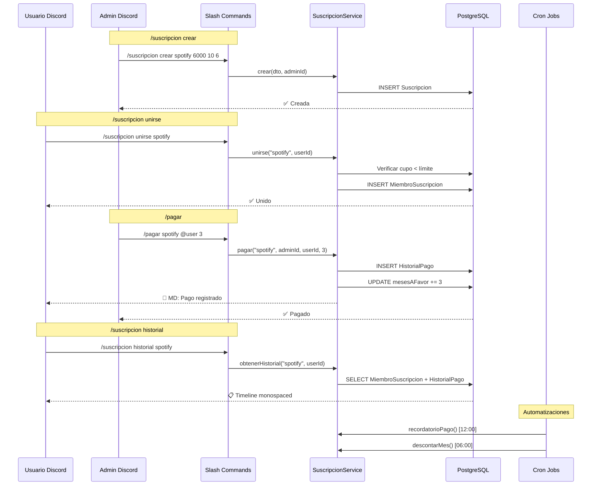
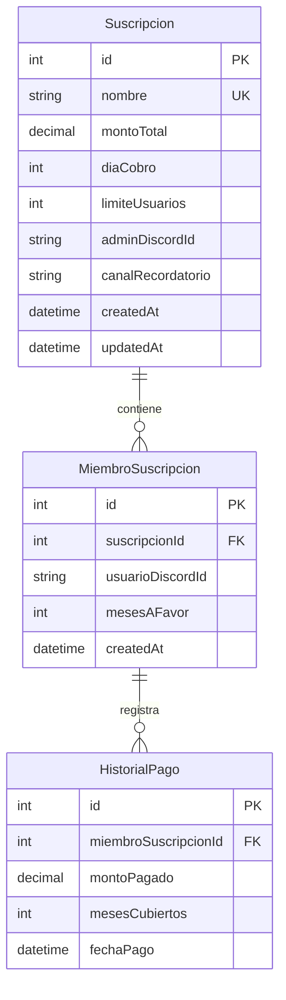
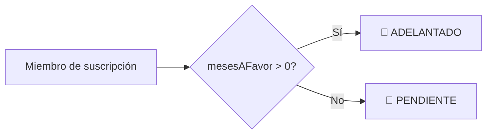

# Implementación del SuscripcionModule

> [!success] Estado
> ✅ **Completado** — Módulo de suscripciones compartidas implementado y compila sin errores.

## Resumen

Sistema de gestión de suscripciones compartidas para comunidades de Discord. Permite administrar pagos mensuales, meses por adelantado, control de cupos, historial de pagos con timeline visual, y automatizaciones vía cron jobs.

## Arquitectura del SuscripcionModule

### Estructura de Archivos

```
src/suscripcion/
├── dto/
│   ├── crear-suscripcion.dto.ts       ← DTO para crear suscripción
│   ├── modificar-suscripcion.dto.ts   ← DTO para modificar monto
│   └── pagar.dto.ts                   ← DTO para registrar pago
├── suscripcion.service.ts             ← Lógica de negocio (9 métodos)
├── suscripcion.command.ts             ← Slash commands (/suscripcion + /pagar)
├── suscripcion.job.ts                 ← Cron jobs (recordatorio + cierre)
└── suscripcion.module.ts             ← Módulo NestJS
```

### Flujo de Datos Completo



## Modelo de Datos

### Diagrama ER



### Schema Prisma

```prisma
model Suscripcion {
  id                Int      @id @default(autoincrement())
  nombre            String   @unique
  montoTotal        Decimal
  diaCobro          Int
  limiteUsuarios    Int
  adminDiscordId    String
  canalRecordatorio String?
  createdAt         DateTime @default(now())
  updatedAt         DateTime @updatedAt

  miembros MiembroSuscripcion[]
}

model MiembroSuscripcion {
  id               Int      @id @default(autoincrement())
  suscripcionId    Int
  usuarioDiscordId String
  mesesAFavor      Int      @default(0)
  createdAt        DateTime @default(now())

  suscripcion Suscripcion   @relation(fields: [suscripcionId], references: [id], onDelete: Cascade)
  historial   HistorialPago[]

  @@unique([suscripcionId, usuarioDiscordId])
}

model HistorialPago {
  id                   Int      @id @default(autoincrement())
  miembroSuscripcionId Int
  montoPagado          Decimal
  mesesCubiertos       Int
  fechaPago            DateTime @default(now())

  miembro MiembroSuscripcion @relation(fields: [miembroSuscripcionId], references: [id], onDelete: Cascade)
}
```

### Migración

```bash
npx prisma migrate dev --name add_suscripcion
```

## SuscripcionService

### Métodos Expuestos

| Método | Parámetros | Retorno | Descripción |
|--------|-----------|---------|-------------|
| `crear` | `dto: CrearSuscripcionDto`, `adminId: string` | `Suscripcion` | Crear nueva suscripción |
| `modificar` | `nombre: string`, `nuevoMontoTotal: number` | `Suscripcion` | Actualizar monto total |
| `unirse` | `nombreSusc: string`, `userId: string` | `MiembroSuscripcion` | Unirse voluntariamente (público) |
| `agregar` | `nombreSusc: string`, `adminId: string`, `userId: string` | `MiembroSuscripcion` | Admin fuerza alta de usuario |
| `remover` | `nombreSusc: string`, `adminId: string`, `userId: string` | `void` | Admin da de baja a usuario |
| `pagar` | `nombreSusc: string`, `adminId: string`, `userId: string`, `meses: int` | `{ montoPagado }` | Registrar pago + enviar MD |
| `obtenerEstado` | `nombreSusc: string` | `EstadoData` | Embed con cuota, cupos, miembros |
| `obtenerHistorial` | `nombreSusc: string`, `userId: string` | `{ timeline, resumen }` | Timeline mes a mes |
| `obtenerMiembrosPendientes` | `suscripcionId: int` | `MiembroSuscripcion[]` | Miembros con `mesesAFavor === 0` |
| `descontarMes` | `suscripcionId: int` | `void` | Decrementa `mesesAFavor` en 1 para todos |

### Lógica de Estados



### Lógica del Timeline (Historial)

El timeline se construye así:

1. Se obtiene el mes y año actual como referencia.
2. Se proyectan meses desde el actual hasta donde alcance `mesesAFavor`.
3. Para `i = 0` (mes actual) → `🟢 AL DÍA`.
4. Para `i > 0` hasta `mesesAFavor` → `💎 ADELANTADO`.
5. El mes siguiente a `mesesAFavor` → `🔴 PENDIENTE`.
6. La fecha de pago se extrae de los registros `HistorialPago` cronológicos.

### Envío de Mensaje Directo

Al registrar un pago vía `/pagar`, el bot envía automáticamente un MD al usuario beneficiado:

```
✅ Se ha registrado tu pago para spotify.
Monto: $10.00
Meses cubiertos: 3
```

> [!warning] El MD puede fallar si el usuario tiene bloqueados los mensajes privados del servidor. El error se loggea pero no interrumpe el flujo.

## Slash Commands

### `/suscripcion` (Subcomandos agrupados)

| Subcomando | Permisos | Opciones | Descripción |
|-----------|----------|----------|-------------|
| `crear` | Admin global | `nombre`, `monto_total`, `dia_cobro`, `limite_usuarios`, `canal_recordatorio?` | Registrar nueva suscripción |
| `modificar` | Admin global | `nombre`, `nuevo_monto_total` | Cambiar monto total |
| `unirse` | **Público** | `nombre` | Unirse voluntariamente |
| `agregar` | Admin suscripción | `nombre`, `usuario` | Forzar alta de usuario |
| `remover` | Admin suscripción | `nombre`, `usuario` | Dar de baja a usuario |
| `estado` | **Público** | `nombre` | Ver estado general (embed) |
| `historial` | **Público** | `nombre` | Ver timeline personal de pagos |

### `/pagar` (Comando independiente)

| Permisos | Opciones | Descripción |
|----------|----------|-------------|
| Admin suscripción | `suscripcion`, `usuario`, `meses` | Registrar pago y enviar MD |

### Permisos

| Nivel | Subcomandos | Check |
|-------|-------------|-------|
| Admin global (`Administrator`) | `crear`, `modificar` | `interaction.memberPermissions?.has('Administrator')` |
| Admin de suscripción | `agregar`, `remover`, `pagar` | `interaction.user.id === suscripcion.adminDiscordId` |
| Público | `unirse`, `estado`, `historial` | Sin restricciones |

> [!info] El admin de suscripción se define al crear la suscripción (`adminDiscordId`). No necesariamente debe ser Admin global del servidor.

## Cron Jobs

### Cron 1: Recordatorio de Pago

- **Schedule:** `0 12 * * *` (12:00 PM todos los días)
- **Lógica:** Por cada suscripción, calcula si hoy es `diaCobro - 3`. Si coincide, obtiene miembros con `mesesAFavor === 0` y envía un mensaje al `canalRecordatorio` configurado.

```typescript
@Cron('0 12 * * *')
async recordatorioPago(): Promise<void> {
  // Buscar suscripciones donde diaCobro - 3 === today
  // Enviar alerta al canal con @menciones de pendientes
}
```

### Cron 2: Cierre de Ciclo Mensual

- **Schedule:** `0 6 * * *` (6:00 AM todos los días)
- **Lógica:** Por cada suscripción, si `diaCobro === yesterday`, ejecuta `descontarMes()` que resta 1 a `mesesAFavor` de todos los miembros con saldo > 0.

```typescript
@Cron('0 6 * * *')
async cierreMensual(): Promise<void> {
  // Buscar suscripciones donde diaCobro === yesterday
  // UPDATE MiembroSuscripcion SET mesesAFavor = GREATEST(0, mesesAFavor - 1)
}
```

> [!tip] El sistema maneja bordes de mes correctamente: usa `new Date()` con `setDate()` para calcular "ayer" y "3 días antes" de forma segura.

## Incidencias

### Incidencia: Falta de guild commands centralizados

Al igual que `ModerationCommand`, `SuscripcionCommand` usa `rest.put(Routes.applicationGuildCommands(...))` para registrar comandos. Como ambos módulos hacen `PUT` independientes, **el último en ejecutarse sobreescribe al anterior**.

Si `SuscripcionCommand.onModuleInit()` se ejecuta después que `ModerationCommand.onModuleInit()`, el comando `/modconfig` desaparece de Discord (y viceversa).

> [!warning] Esto significa que en el estado actual, después de reiniciar el bot solo estarán disponibles `/suscripcion` y `/pagar`. El comando `/modconfig` de moderación se pierde.
>
> **Solución propuesta:** Centralizar el registro de todos los comandos en un único `PUT` o migrar a comandos globales (`Routes.applicationCommands(...)`).

## Archivos Creados/Modificados

```
src/
├── app.module.ts                              ← MODIFICADO: importa SuscripcionModule
│
├── suscripcion/                               ← NUEVO
│   ├── dto/
│   │   ├── crear-suscripcion.dto.ts
│   │   ├── modificar-suscripcion.dto.ts
│   │   └── pagar.dto.ts
│   ├── suscripcion.service.ts
│   ├── suscripcion.command.ts
│   ├── suscripcion.job.ts
│   └── suscripcion.module.ts

prisma/
├── schema.prisma                              ← MODIFICADO: +3 modelos
│
└── migrations/
    └── 20260522061041_add_suscripcion/        ← NUEVA migración
```

## Referencias

- [[Arquitectura Bot Discord#Diagrama de Componentes]]
- [[Arquitectura Bot Discord#Modelo de Datos Principal]] — modelo legacy
- [[Implementacion ModerationModule]] — patrón de referencia para módulos
- [[Guia de Uso - Suscripciones Compartidas]] — instructivo para usuarios del bot
