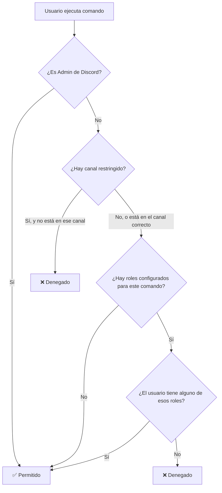

# RBAC y Restricción de Canal — Suscripciones

> [!success] Estado
> ✅ **Completado** — Sistema de permisos por roles (RBAC) y restricción de canal implementado y compila sin errores.

## Resumen

Se agregaron dos funcionalidades de gobernanza al módulo de suscripciones:

1. **Restricción de canal** — los comandos de suscripción pueden limitarse a un solo canal de texto.
2. **Permisos por roles (RBAC)** — los administradores del servidor asignan qué roles de Discord pueden usar cada comando individualmente.

Esto reemplaza el modelo anterior donde `crear`/`modificar` requerían `Administrator` global y `agregar`/`remover`/`pagar` requerían ser el dueño de la suscripción (`adminDiscordId`).

## Modelo de Datos

### Nuevo campo en Guild

```prisma
model Guild {
  ...
  canalSuscripciones  String?               // ← NUEVO: ID del canal restringido
  permisosSuscripcion PermisoSuscripcion[]  // ← NUEVA relación
  ...
}
```

### Nuevo modelo PermisoSuscripcion

```prisma
model PermisoSuscripcion {
  id      String @id @default(cuid())
  guildId String
  comando String   // "crear" | "modificar" | "unirse" | "agregar" | "remover" | "estado" | "historial" | "pagar"
  roleId  String   // ID del rol de Discord

  guild Guild @relation(fields: [guildId], references: [id])

  @@unique([guildId, comando, roleId])
}
```

Cada fila representa: "En este servidor, este rol puede usar este comando". La constraint unique evita duplicados.

### Migración

```bash
npx prisma migrate dev --name add_suscripcion_config
```

## Lógica de Resolución de Permisos

Para **cualquier** comando de suscripción (`/suscripcion` o `/pagar`), el bot evalúa en este orden:



### Reglas generales

- Si **no hay roles configurados** para un comando → **cualquiera** puede usarlo (comportamiento libre).
- Si **hay al menos un rol** configurado → solo quienes tengan ese rol (o sean Administradores de Discord) pueden usarlo.
- La restricción de canal aplica a **todos** los comandos de suscripción, incluyendo `/pagar`.

## Nuevos Comandos Slash

### `/suscripcion config`

| Subcomando | Opciones | Requisito | Descripción |
|-----------|----------|-----------|-------------|
| `canal` | `canal: #text-channel` | Administrator | Fija el canal donde se permiten comandos de suscripción |
| `canal-reset` | — | Administrator | Elimina la restricción de canal |

### `/suscripcion permisos`

| Subcomando | Opciones | Requisito | Descripción |
|-----------|----------|-----------|-------------|
| `agregar` | `comando: (elegir)`, `rol: @rol` | Administrator | Asigna un rol a un comando |
| `remover` | `comando: (elegir)`, `rol: @rol` | Administrator | Quita un rol de un comando |
| `listar` | — | Administrator | Muestra la matriz de permisos actual |

El parámetro `comando` ofrece las siguientes opciones: `crear`, `modificar`, `unirse`, `agregar`, `remover`, `estado`, `historial`, `pagar`.

### Ejemplos de uso

```
/suscripcion config canal #finanzas
/suscripcion permisos agregar comando:crear rol:@Mod-Spotify
/suscripcion permisos agregar comando:pagar rol:@Mod-Spotify
/suscripcion permisos agregar comando:unirse rol:@Miembro
/suscripcion permisos listar
/suscripcion permisos remover comando:crear rol:@Mod-Spotify
/suscripcion config canal-reset
```

## Cambios en SuscripcionService

### Métodos nuevos

| Método | Parámetros | Retorno | Descripción |
|--------|-----------|---------|-------------|
| `obtenerCanalSuscripciones` | `guildId: string` | `string \| null` | Obtiene el canal restringido |
| `actualizarCanalSuscripciones` | `guildId: string`, `channelId: string \| null` | `void` | Establece o elimina la restricción de canal |
| `agregarPermiso` | `guildId: string`, `comando: string`, `roleId: string` | `void` | Asigna un rol a un comando |
| `removerPermiso` | `guildId: string`, `comando: string`, `roleId: string` | `void` | Quita un rol de un comando |
| `listarPermisos` | `guildId: string` | `{ comando, roleId }[]` | Lista todos los permisos |
| `verificarPermiso` | `guildId: string`, `roleIds: string[]`, `comando: string` | `'allowed' \| 'denied' \| 'no_config'` | Evalúa si un usuario tiene permiso |

### Métodos modificados

Los métodos `agregar`, `remover` y `pagar` ya no reciben `adminDiscordId` ni validan ownership mediante `verificarAdmin`. La autorización ahora se maneja exclusivamente en el command handler mediante roles.

## Cambios en SuscripcionCommand

### Validaciones en el listener (`interactionCreate`)

```typescript
if (interaction.commandName === 'suscripcion') {
  if (!await this.verificarCanal(interaction)) return;
  await this.handleSuscripcion(interaction);
} else if (interaction.commandName === 'pagar') {
  if (!await this.verificarCanal(interaction)) return;
  if (!await this.verificarPermisoComando(interaction, 'pagar')) return;
  await this.handlePagar(interaction);
}
```

### Resumen de permisos reemplazados

| Comando | Antes | Ahora |
|---------|-------|-------|
| `crear` | `Administrator` | Rol `crear` o `Administrator` |
| `modificar` | `Administrator` | Rol `modificar` o `Administrator` |
| `unirse` | Público | Rol `unirse` o público (si sin config) |
| `agregar` | Dueño suscripción | Rol `agregar` o `Administrator` |
| `remover` | Dueño suscripción | Rol `remover` o `Administrator` |
| `estado` | Público | Rol `estado` o público (si sin config) |
| `historial` | Público | Rol `historial` o público (si sin config) |
| `pagar` | Dueño suscripción | Rol `pagar` o `Administrator` |
| `config` | — | Solo `Administrator` |
| `permisos` | — | Solo `Administrator` |

## Archivos Modificados

```
prisma/
├── schema.prisma                              ← MODIFICADO: +campo canalSuscripciones, +modelo PermisoSuscripcion
└── migrations/
    └── 20260523031138_add_suscripcion_config/ ← NUEVA migración

src/
├── suscripcion/
│   ├── suscripcion.service.ts                 ← MODIFICADO: +6 métodos, -validación admin en agregar/remover/pagar
│   └── suscripcion.command.ts                 ← MODIFICADO: +config, +permisos, +verificarCanal, +verificarPermisoComando
```

## Referencias

- [[Implementacion SuscripcionModule]] — documentación técnica original del módulo
- [[Guia de Uso - Suscripciones Compartidas]] — instructivo para usuarios del bot
- [[Arquitectura Bot Discord]] — arquitectura general del bot
