# Setup Inicial del Proyecto

> [!abstract] Objetivo
> Inicializar el proyecto NestJS, configurar Docker con PostgreSQL, integrar Prisma ORM, y dejar la base lista para empezar a implementar los módulos del bot.

## Herramientas Verificadas

Antes de empezar se verificó el entorno:

| Herramienta | Versión | Estado |
|-------------|---------|--------|
| Node.js | v22.20.0 | ✅ |
| npm | 11.6.2 | ✅ |
| Docker | 29.4.0 | ✅ |
| Docker Compose | v5.1.1 | ✅ |
| Git | 2.51.0 | ✅ |

## Desarrollo Agentic

El setup se dividió en **dos fases ejecutadas con agentes en paralelo**:

### Fase 1 — Agentes en Paralelo

```mermaid
gantt
    title Fase 1 - Paralelo
    dateFormat  HH:mm
    axisFormat %H:%M
    
    section Agente A
    NestJS Init + npm install     :a1, 09:00, 4m
    
    section Agente B
    Docker infra + .gitignore     :b1, 09:00, 2m
```



#### Agente A: NestJS + dependencias

- Inicializó el proyecto con `@nestjs/cli`
- Instaló todas las dependencias del stack:
  - `discord.js`, `@discordjs/rest`, `@discordjs/builders`
  - `@nestjs/schedule`
  - `@prisma/client`, `prisma`
  - `class-validator`, `class-transformer`
  - `pino`

#### Agente B: Infraestructura base

Creó los archivos base del proyecto:

- [[Docker#Docker Compose|docker-compose.yml]] — PostgreSQL 16 Alpine con health check
- `.env.example` — Template de variables de entorno
- [[Docker#Dockerfile|Dockerfile]] — Multi-stage build
- `.gitignore` — Exclusiones para GitHub

### Fase 2 — Secuencia

```mermaid
gantt
    title Fase 2 - Secuencial
    dateFormat  HH:mm
    axisFormat %H:%M
    
    section Agente C
    Schema Prisma + Module + Migration  :c1, 09:05, 5m
    
    section Post-Fix
    Puerto PostgreSQL                   :d1, after c1, 2m
    
    section Setup Final
    PrismaService v7 + Health + Build   :e1, after d1, 2m
```



#### Agente C: Prisma schema + módulo

- Definió el [[Arquitectura Bot Discord#Modelo de Datos Principal|schema con 5 modelos]]
- Creó [[Prisma#Conexión con NestJS|PrismaService]] y PrismaModule

## Incidentes y Soluciones

### ⚠️ Issue #1: npm bloqueado por PowerShell

**Problema:** La ejecución de scripts de PowerShell estaba deshabilitada, bloqueando npm.

**Solución:**
```powershell
Set-ExecutionPolicy -Scope CurrentUser -ExecutionPolicy RemoteSigned
```

### ⚠️ Issue #2: Prisma v7 cambió la API

**Problema:** Prisma 7.8.0 eliminó el campo `url` del datasource en schema.prisma y el `PrismaClient` ahora requiere un adapter.

**Solución:**
1. Se movió la URL a `prisma.config.ts`
2. Se instaló `@prisma/adapter-pg`
3. Se configuró `PrismaService` con `new PrismaPg(...)`:
   ```typescript
   const adapter = new PrismaPg({ connectionString: process.env.DATABASE_URL! });
   super({ adapter });
   ```
4. Se definió `output` del generador en `src/generated/prisma`

### ⚠️ Issue #3: Puerto PostgreSQL conflictivo

**Problema:** Había un **PostgreSQL nativo de Windows** (PostgreSQL 18) ocupando el puerto `5432`, impidiendo la conexión al contenedor Docker.

**Solución:** Se cambió el puerto mapeado de Docker a `5433:5432` y se actualizaron las URLs en `.env`, `.env.example` y `prisma.config.ts`.

```yaml
# docker-compose.yml
ports:
  - "5433:5432"   # Host:Container
```

## Estructura Final del Proyecto

```
bot_discord/
│
├── src/                          ← Código fuente
│   ├── main.ts                   ← Entry point
│   ├── app.module.ts             ← Módulo raíz (Schedule + Prisma)
│   ├── health.controller.ts      ← GET /health
│   ├── generated/prisma/         ← Cliente Prisma (auto-generado)
│   └── prisma/
│       ├── prisma.module.ts      ← Módulo global de Prisma
│       └── prisma.service.ts     ← Conexión con adapter Prisma v7
│
├── prisma/
│   ├── schema.prisma             ← Modelos de datos
│   └── migrations/               ← Historial de migraciones
│
├── Matias_Rodriguez/             ← Documentación (vault Obsidian)
│   └── 00-analisis-estructura/   ← Fase de análisis
│
├── docker-compose.yml            ← PostgreSQL container
├── Dockerfile                    ← Multi-stage build
├── prisma.config.ts              ← Configuración Prisma v7
├── .env                          ← Variables locales (ignorado)
├── .env.example                  ← Template de variables
└── .gitignore                    ← Exclusiones GitHub
```

## Comandos Útiles

```bash
# Iniciar PostgreSQL
docker compose up -d postgres

# Ver logs de PostgreSQL
docker compose logs -f postgres

# Aplicar migraciones
npx prisma migrate deploy

# Abrir Prisma Studio
npx prisma studio --config prisma.config.ts

# Build del proyecto
npm run build

# Iniciar en desarrollo
npm run start:dev
```

## Estado Actual de la DB

La migración inicial `20260520231023_init` fue aplicada exitosamente. La base de datos tiene las 5 tablas listas:

- `Guild` — servidores de Discord
- `Member` — miembros con tracking de actividad
- `ActivityEvent` — eventos individuales de actividad
- `GuildConfig` — configuración por servidor
- `ModerationLog` — historial de acciones de moderación

## Próximos Pasos

1. [[Implementar ActivityModule]] — rastrear actividad de usuarios
2. [[Implementar ModerationModule]] — ejecutar kicks/bans automáticos
3. Registrar el bot en [[Registrar Bot en Discord Portal|Discord Portal]]
4. Configurar [[Configurar NestJS + Prisma#5. Configurar Módulo Schedule|Slash Commands]]

---

> [!tip] Referencia
> Todo el detalle arquitectónico está en [[Arquitectura Bot Discord]] y los documentos asociados en `00-analisis-estructura/`.
